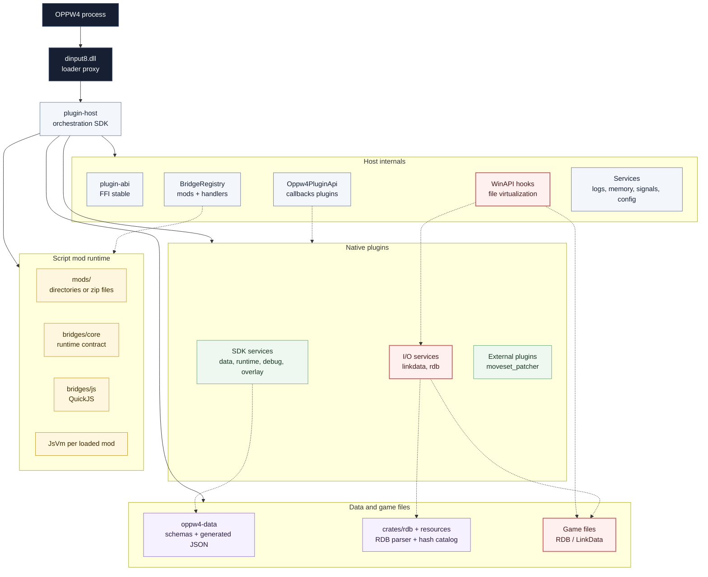
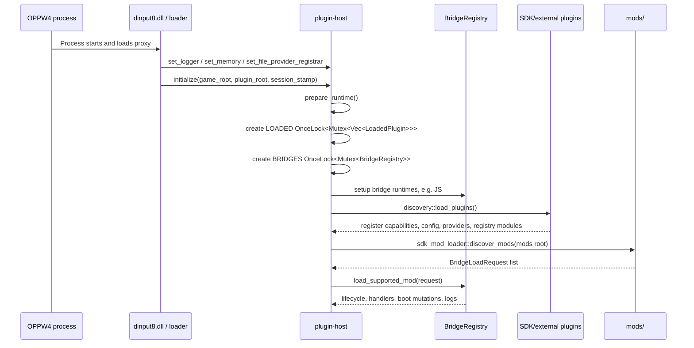
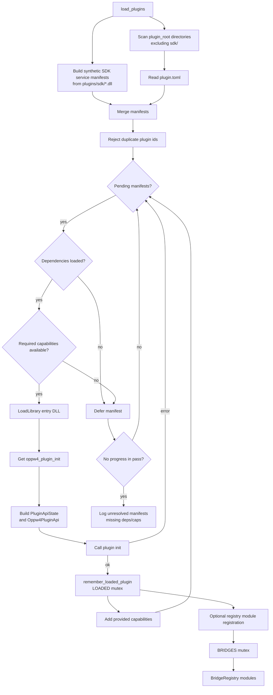
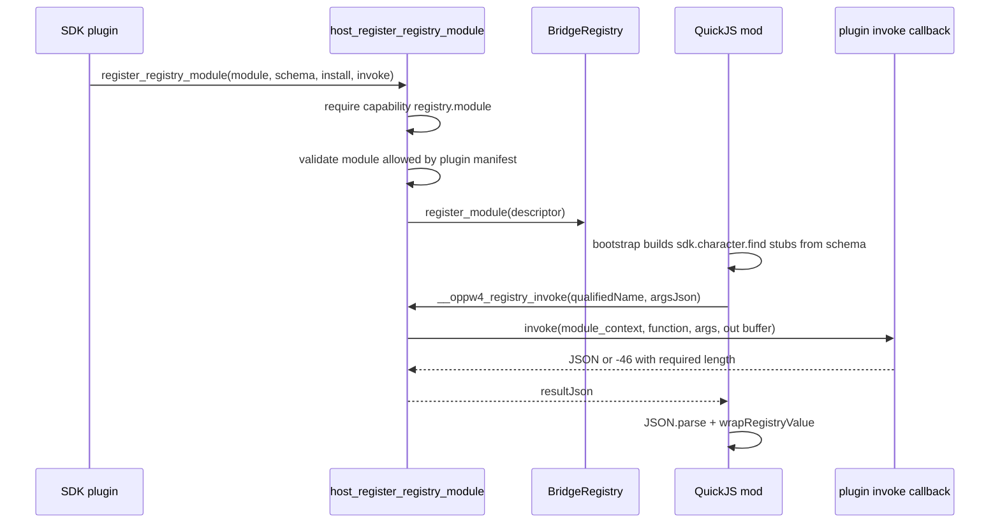
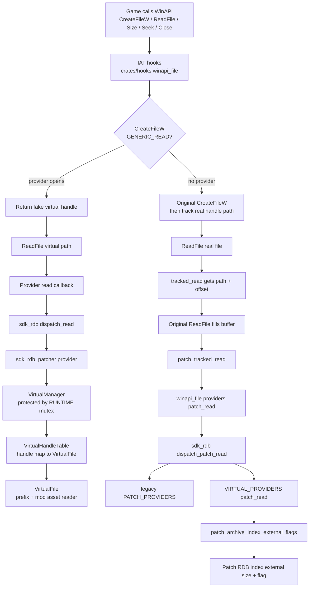
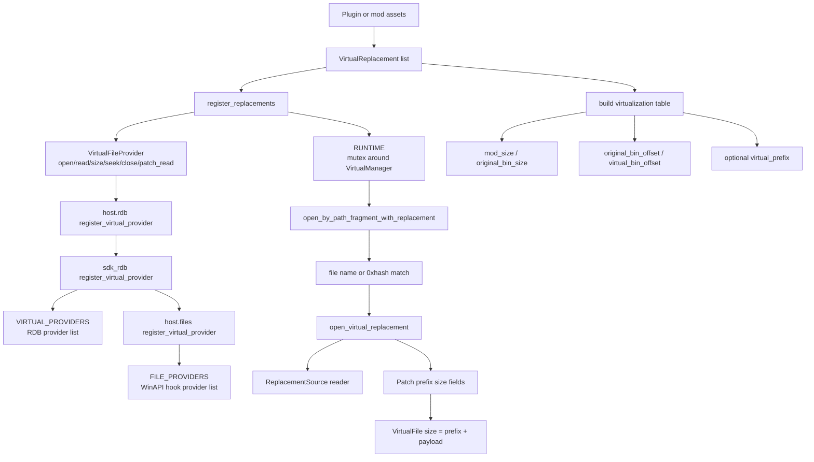
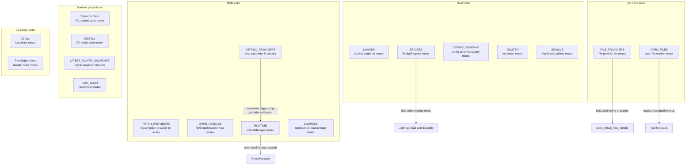
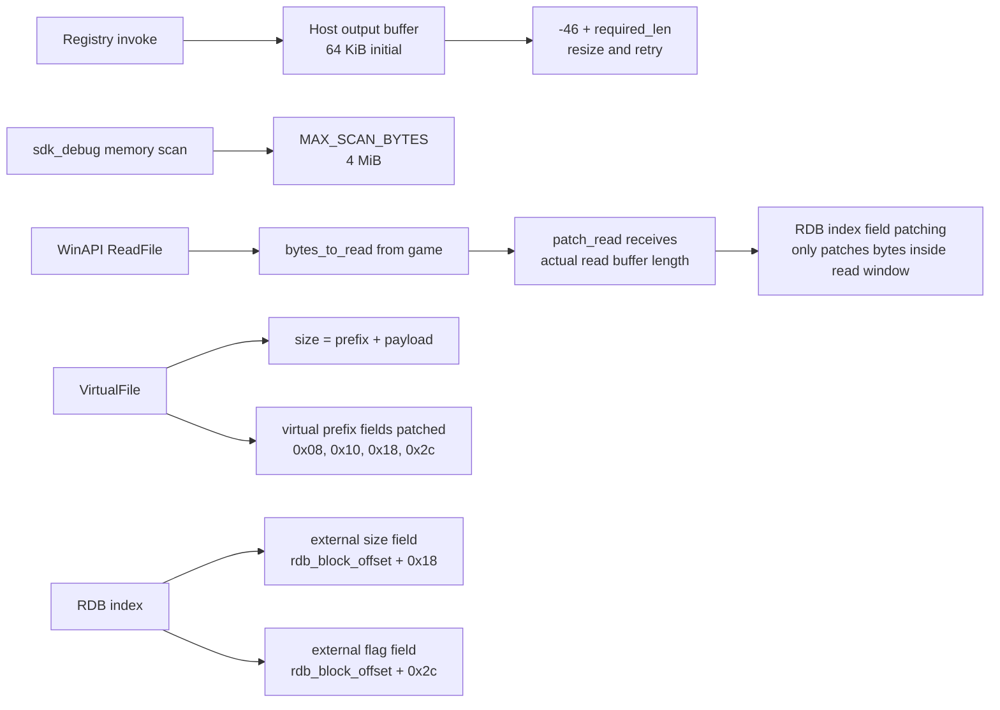

# Application Diagrams

Ces diagrammes décrivent l'application telle qu'elle est organisée dans ce
workspace. Ils sont faits pour aider une session de debug future, notamment sur
les zones de lock, de virtualisation fichier/RDB et de buffers.

## Vue Globale

## Execution Globale

```mermaid
flowchart LR
    classDef step fill:#f3f6fb,color:#172033,stroke:#6b7a90,stroke-width:1px
    classDef plugin fill:#eef8f1,color:#17351f,stroke:#62a874,stroke-width:1px
    classDef bridge fill:#fff6df,color:#3a2a00,stroke:#c69a2d,stroke-width:1px
    classDef io fill:#fff0f0,color:#441818,stroke:#c46a6a,stroke-width:2px

    Start["1. Game loads<br>dinput8.dll"] --> Init["2. Loader calls<br>plugin-host initialize()"]
    Init --> Prepare["3. Host prepares runtime<br>logs + locks + BridgeRegistry"]
    Prepare --> RegisterBridge["4. Host registers bridge runtimes<br>example: JS bridge"]
    RegisterBridge --> LoadPlugins["5. Host loads native plugins<br>SDK services then externals"]
    LoadPlugins --> PluginInit["6. Plugins init with Oppw4PluginApi<br>register capabilities/providers/modules"]
    PluginInit --> ScanMods["7. Host scans mods/<br>directories and zip files"]
    ScanMods --> DiscoverMods["8. sdk-mod-loader<br>discovers mods + reads mod.toml"]
    DiscoverMods --> Requests["9. Build BridgeLoadRequest<br>id, entry file, uses.plugins"]
    Requests --> ChooseBridge["10. BridgeRegistry chooses runtime<br>.js goes to JsBridge"]
    ChooseBridge --> LoadJs["11. JsBridge creates QuickJS VM<br>installs globals + registry stubs"]
    LoadJs --> Ready["12. Mod handlers are registered<br>runtime can dispatch events"]

    PluginInit -.-> RegistryModules["Registry modules<br>available to JS mods"]
    PluginInit -.-> VirtualProviders["File/RDB providers<br>used by WinAPI hooks"]
    RegistryModules -.-> LoadJs
    VirtualProviders -.-> GameReads["Later: game file reads<br>can be virtualized/patched"]

    class Start,Init,Prepare,ScanMods,DiscoverMods,Requests,Ready step
    class LoadPlugins,PluginInit plugin
    class RegisterBridge,ChooseBridge,LoadJs,RegistryModules bridge
    class VirtualProviders,GameReads io
```

## Bootstrap Runtime

## Chargement Plugins

## Chargement Mods Et Bridge JS

```mermaid
flowchart LR
    ModsRoot["mods root"] --> Discover["sdk-mod-loader discover_mods"]
    Discover --> DirMod["Directory with mod.toml"]
    Discover --> ZipMod["Zip with one mod.toml"]
    DirMod --> Parse["parse_mod_manifest"]
    ZipMod --> Parse
    Parse --> Request["BridgeLoadRequest<br>mod id, entry_file, uses_plugins"]

    Request --> Registry["BridgeRegistry"]
    Registry --> BridgeFor["Find exactly one runtime<br>matching entry file"]
    BridgeFor --> ModulesFor["Select registry modules<br>Always or requested by uses.plugins"]
    ModulesFor --> Context["BridgeModContext"]
    Context --> JsBridge["JsBridge load_mod"]
    JsBridge --> Runtime["QuickJS Runtime"]
    Runtime --> JsContext["QuickJS Context"]
    JsContext --> Globals["install_mod_globals"]
    Globals --> Handlers["install handler registry"]
    Handlers --> Modules["install registry modules"]
    Modules --> Api["install oppw4 API bootstrap"]
    Api --> Sandbox["hide unsafe globals"]
    Sandbox --> Entry["Evaluate JS entry module"]
    Entry --> Report["BridgeLoadReport<br>handlers + logs"]
    Report --> HandlerMap["handlers_by_event"]
```

## Registry Modules Et Appels JS

Point à retenir pour le debug : l'invocation registry démarre avec un buffer
host de `64 * 1024` octets et retry si le callback renvoie `-46` avec une
taille requise plus grande.

## Virtualisation Fichier Et RDB

## RDB Remplacement Skin/Asset

## Carte Des Locks Et Singletons

Zones à surveiller plus tard :

- `BRIDGES` est verrouillé pendant `load_supported_mod` et `dispatch_event`.
- `FILE_PROVIDERS` est verrouillé pendant l'itération des providers, y compris
  l'appel `open_path`.
- `VIRTUAL_PROVIDERS` et `PATCH_PROVIDERS` sont verrouillés pendant certains
  callbacks provider dans `sdk_rdb`.
- `RUNTIME` du patcher RDB protège le `VirtualManager`, donc les opérations
  `open/read/seek/size/patch` sont sérialisées.
- Les appels provider s'enchaînent entre hooks WinAPI, `sdk_rdb`, puis patcher
  RDB. C'est la zone la plus importante à inspecter pour un blocage lié aux I/O.

## Buffers Et Tailles Fixes À Vérifier

Ce diagramme ne conclut pas sur la cause du blocage à 5 Mo. Il liste seulement
les endroits où une taille déclarée, une taille lue, un offset virtuel ou un
lock peut produire un symptôme de chargement bloqué.
