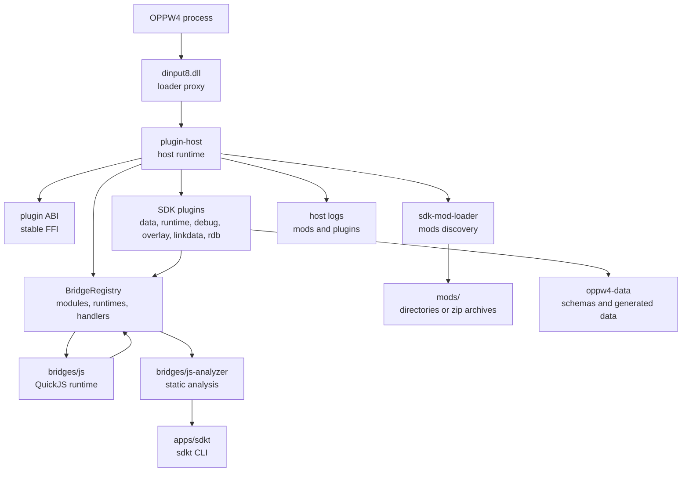
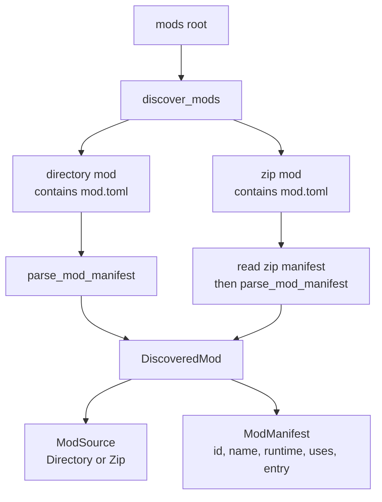
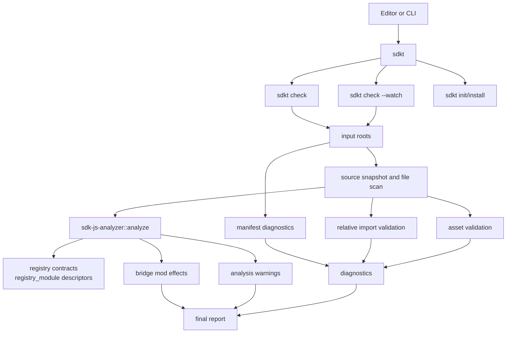
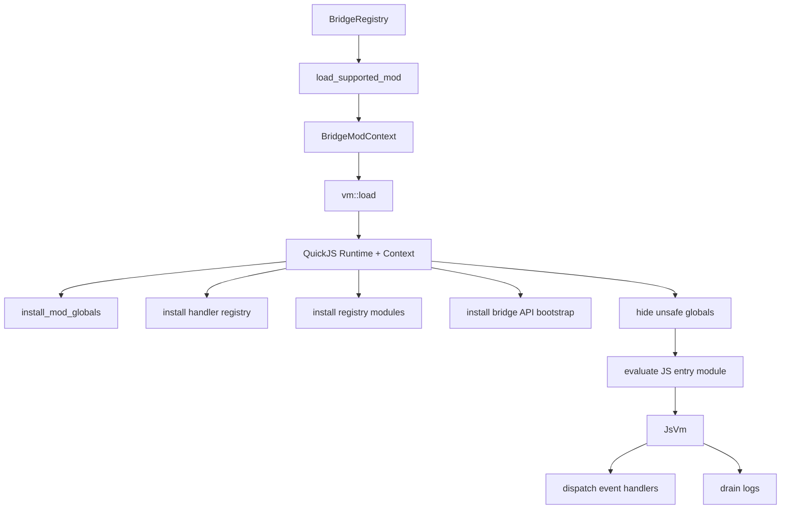
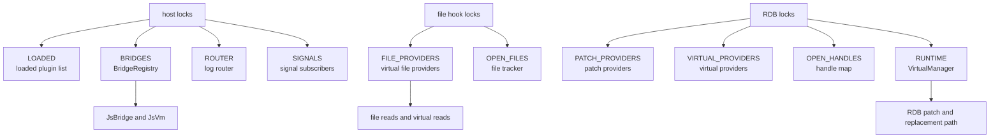

# Application Diagrams

These diagrams describe the current branch: host/runtime, `sdk-mod-loader`,
`sdkt`, `js-analyzer`, and the JS bridge.

## Overview

## Runtime Flow

```mermaid
flowchart LR
    Start["1. Game loads<br>dinput8.dll"] --> Init["2. Loader calls<br>plugin_host initialize"]
    Init --> Prepare["3. Host prepares runtime<br>locks and log router"]
    Prepare --> Setup["4. Register bridge runtimes<br>example: JS bridge"]
    Setup --> LoadPlugins["5. Load SDK plugins<br>from plugin_root"]
    LoadPlugins --> PluginInit["6. Plugins init through<br>Oppw4PluginApi"]
    PluginInit --> ScanMods["7. Scan mods/<br>with sdk-mod-loader"]
    ScanMods --> Parse["8. Parse mod.toml<br>directory or zip"]
    Parse --> Request["9. Build BridgeLoadRequest<br>mod id, entry file, uses.plugins"]
    Request --> Choose["10. BridgeRegistry picks runtime<br>.js goes to JsBridge"]
    Choose --> LoadJs["11. JsBridge builds QuickJS VM<br>installs globals and registry stubs"]
    LoadJs --> Ready["12. Mod is loaded<br>handlers and logs registered"]
```

## Mod Loader

## Analyzer Flow

## Bridge JS Runtime

## Lock Surface

This document is intentionally high level. It is meant to make the runtime shape
and the debug surface obvious before digging into a specific bug.
